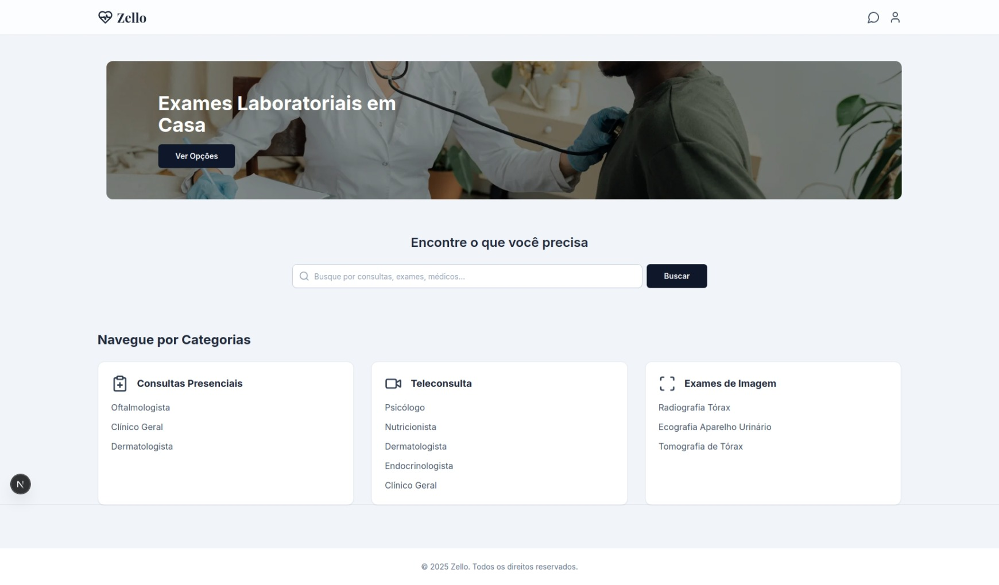

# 🩺 Projeto Zello - Plataforma de Telemedicina



**Zello** é uma plataforma de telemedicina moderna e distribuída, projetada para conectar pacientes e médicos de forma simples, segura e eficiente. Este projeto foi desenvolvido com foco em arquitetura de microsserviços, comunicação assíncrona e práticas modernas de desenvolvimento de software, atendendo aos requisitos da disciplina de Sistemas Distribuídos.

---

## Tabela de Conteúdos
1.  [Arquitetura](#️-arquitetura)
2.  [Tecnologias Utilizadas](#-tecnologias-utilizadas)
3.  [Guia de Instalação e Execução](#-guia-de-instalação-e-execução)
    - [Pré-requisitos](#1-pré-requisitos)
    - [Configuração do Ambiente](#2-configuração-do-ambiente)
    - [Executando a Aplicação](#3-executando-a-aplicação)
    - [Populando o Banco de Dados](#4-populando-o-banco-de-dados)
4.  [Validando a Instalação](#-validando-a-instalação)
5.  [Solução de Problemas Comuns](#-solução-de-problemas-comuns-troubleshooting)

---

## 🏛️ Arquitetura

O sistema é construído sobre uma **arquitetura de microsserviços**, onde cada componente tem uma responsabilidade única e um banco de dados isolado. Isso garante que o sistema seja escalável, resiliente e fácil de manter.

-   **`api-gateway` (Go & Gin):** O nosso "porteiro". É o ponto de entrada único para todas as requisições do frontend, responsável por rotear o tráfego para o serviço interno correto e gerenciar a segurança de borda (CORS).

-   **`srv-usuarios` (Python & FastAPI):** O serviço de "Recursos Humanos". Cuida de tudo relacionado à identidade: cadastro, login, perfis de pacientes, médicos e administradores.

-   **`srv-agendamentos` (Python & FastAPI):** O "coração" da plataforma. Gerencia a lógica de negócio principal: as agendas dos médicos, os horários disponíveis e a reserva de consultas.

-   **`app-frontend` (Next.js & React):** A "face" do nosso projeto. É a interface gráfica com a qual os usuários interagem, construída como um módulo independente. 

-   **`rabbitmq` (Message Broker):** O "sistema nervoso" da nossa arquitetura. Prepara o Zello para comunicação assíncrona, permitindo que eventos (como "consulta agendada") sejam enviados entre os serviços sem que um precise conhecer o outro diretamente. 

-   **Bancos de Dados (PostgreSQL):** Cada serviço principal tem sua própria "memória", garantindo o isolamento total dos dados e a autonomia de cada parte do sistema.

Todo o ecossistema é "empacotado" com **Docker** e orquestrado localmente com **Docker Compose**, demonstrando a execução em uma infraestrutura de containers. 

---

## 🛠️ Tecnologias Utilizadas

-   **Backend:** Python (com FastAPI), Go (com Gin)
-   **Frontend:** Next.js (React), TypeScript, Tailwind CSS
-   **Banco de Dados:** PostgreSQL
-   **Mensageria:** RabbitMQ
-   **Containerização:** Docker & Docker Compose

---

## 🚀 Guia de Instalação e Execução

Siga este guia para configurar e rodar o ambiente de desenvolvimento completo em uma nova máquina.

### 1. Pré-requisitos

Antes de começar, garanta que você tenha as seguintes ferramentas instaladas:

-   Git
-   Docker (Desktop ou Engine + Compose Plugin)
-   Node.js (LTS)
-   Go (1.23+)

### 2. Configuração do Ambiente

**a. Clone o Repositório**

```bash
git clone git@github.com:Rafalesson/zello.git
cd zello
```

**b. Configure as Variáveis de Ambiente (Passo Essencial)**

Este arquivo guarda as **chaves secretas** do projeto e **não deve ser enviado para o Git**.

- Na raiz do projeto (`zello/`), crie um arquivo chamado `.env`.
- Copie e cole o conteúdo abaixo dentro dele:

```env
# Chave secreta para assinar os tokens JWT.
# Dica: gere uma chave nova e segura com o comando: openssl rand -hex 32
SECRET_KEY= <SUA SENHA SECRETA AQUI>

# Algoritmo de criptografia
ALGORITHM=HS256

# Tempo de expiração do token em minutos
ACCESS_TOKEN_EXPIRE_MINUTES=30
```

---

## Executando a Aplicação

### 3.a. Inicie o Backend (Docker)

```bash
docker compose up --build -d
```

- `--build`: Força a reconstrução das imagens.
- `-d`: Executa os containers em segundo plano.

### 3.b. Inicie o Frontend

```bash
cd ui/app-frontend
npm install
npm run dev
```

A interface estará disponível em: http://localhost:5000

---

## 🧪 Populando o Banco de Dados

### a. Crie as Especialidades dos Médicos:

```bash
docker compose exec usuarios-service python -m app.cli seed-specialties
```

### b. Crie um Usuário Administrador:

```bash
docker compose exec usuarios-service python -m app.cli create-superuser --email admin@zello.com
```

---

## ✅ Validando a Instalação

- Interface Principal: http://localhost:5000  
- Documentação (Usuários): http://localhost:8001/api/v1/docs  
- Documentação (Agendamentos): http://localhost:8002/api/v1/docs  
- RabbitMQ: http://localhost:15672 (login: guest / guest)

---


